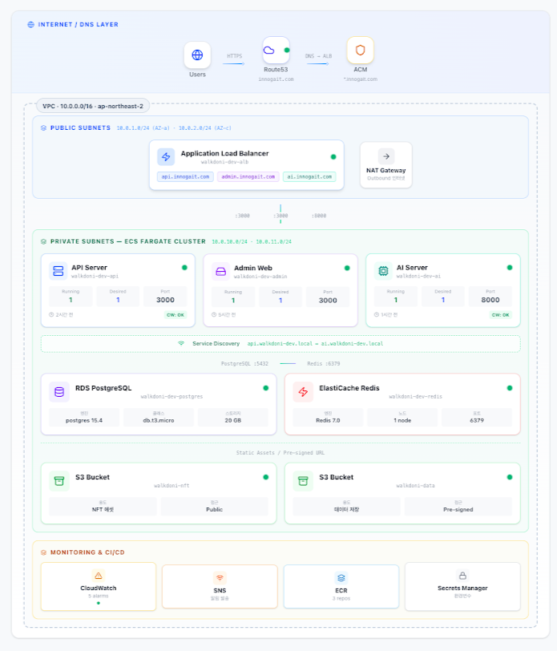

# Diagram Feature Documentation

This document consolidates the implementation details, walkthrough, and steps for the Infrastructure Diagram feature.

## Design Image

---

## Steps to Implement the Infrastructure Diagram

To implement this feature and achieve the look in the provided image, follow these detailed steps:

### Phase 1: Foundation & Layout
1.  **Define Color Palette**: Standardize the colors for different layers.
    -   DNS/Internet: Blue/Cyan
    -   Public Subnets: Blue-Grey
    -   Private Subnets (ECS): Green/Emerald
    -   Data/Storage: Purple/Rose
    -   Monitoring: Amber/Orange
2.  **Container Structure**: Create a nested container structure using Tailwind grid and flexbox.
    -   Outer container: Internet/DNS layer.
    -   Main inner container: The VPC box (with the emerald border and label).
    -   Sub-grid: Split the VPC into Public and Private subnet sections.

### Phase 2: Component Refinement
3.  **Service Cards**: Upgrade the `ServiceCard` component.
    -   Add status indicators (green dots).
    -   Add "Running/Desired" unit labels.
    -   Include the Port number prominently.
4.  **Data & Storage Cards**: Refine `DataCard` and `BucketCard`.
    -   Group RDS/Redis and S3 buckets into their respective rows within the private subnets.
5.  **Monitoring Tiles**: Create a row for the monitoring and CI/CD tools at the bottom.

### Phase 3: Connectors & Details
6.  **Service Discovery Line**: Implement the horizontal "Service Discovery" bar between the ECS cluster and the data layer. Use a dashed border or a light background.
7.  **Connector Arrows**:
    -   Use CSS absolute positioning or SVG paths to draw arrows between layers.
    -   Add text labels (e.g., "HTTPS", "DNS -> ALB") above or beside the connectors.
8.  **Status Indicators**: Add small "CW: OK" badges to represent CloudWatch health checks.

### Phase 4: Polish
9.  **Gradients & Shadows**: Apply subtle gradients to the background of containers and soft shadows to the cards to give them depth.
10. **Dark Mode**: Ensure all colors and borders look great in dark mode using `dark:` prefix.
11. **Responsiveness**: Use responsive grid utilities (e.g., `md:grid-cols-2`, `lg:grid-cols-3`) to handle different screen sizes.

---

## Walkthrough - Infrastructure Diagram Implementation

I have successfully implemented the infrastructure diagram to match the provided design. 

### Changes Made

#### Infrastructure Diagram Component
- **Visual Style**: Used a soft color palette with gradients and shadows for a premium feel.
- **Hierarchical Layout**: Organized the architecture into logical layers:
    - **Internet/DNS**: Shows Users, Route53, and ACM.
    - **VPC (Emerald Border)**: Contains Public and Private subnets.
    - **Public Subnet**: Includes the ALB and NAT Gateway.
    - **Private Subnet (ECS)**: Shows the Fargate Cluster with API, Admin, and AI servers.
    - **Data Layer**: Includes RDS, ElastiCache, and S3 buckets.
    - **Monitoring & CI/CD**: Unified row for CloudWatch, SNS, ECR, and Secrets Manager.
- **Service Discovery**: Added the horizontal bar between ECS and the data layer.
- **Status Indicators**: Implemented small pulsating dots and "CW: OK" badges to indicate health.

### Verification Results

#### Manual Verification
- **Layout Accuracy**: The component structure closely follows the provided image.
- **Iconography**: Used `lucide-react` icons that match the context (Server, Database, Cloud, etc.).
- **Responsiveness**: The diagram uses responsive grid layout (`md:grid-cols-3`, `lg:grid-cols-4`) to adapt to different screen sizes.
- **Dark Mode**: Colors and borders are adjusted for both light and dark themes using Tailwind's `dark:` classes.

#### Code Quality
- Cleaned up unused imports to ensure no linting warnings.
- Structured sub-components (`ECSServiceCard`, `DatabaseCard`, etc.) for better maintainability.
