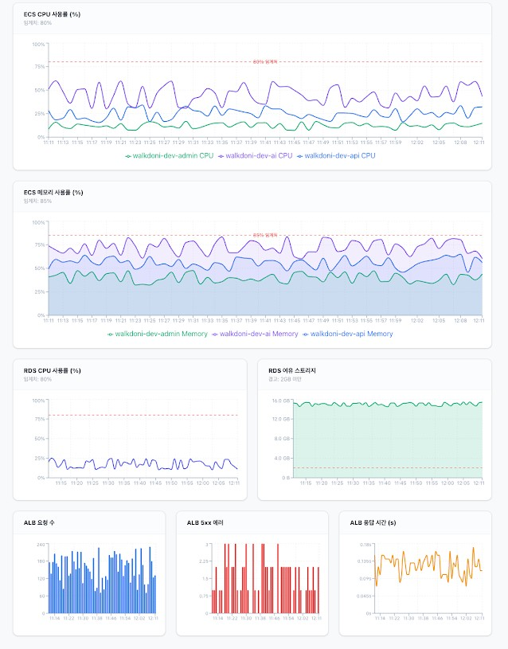

# Monitoring Dashboard Documentation

This document consolidates the implementation plan, changes made, and verification steps for the Monitoring Dashboard feature.

## Design Reference

---

## Implementation Plan

### Goal
Implement a comprehensive monitoring dashboard based on the provided reference image using `recharts`. All charts are consolidated in `app/src/components/Charts.tsx`.

### Proposed Changes
- **Charts.tsx**:
    - Implemented a responsive grid layout.
    - Used `ResponsiveContainer` for all charts.
    - Defined mock data generation for realistic time-series visualization.
    - Implemented individual chart components:
        - `ECSCPUChart`: LineChart with threshold reference lines.
        - `ECSMemoryChart`: AreaChart with gradients and threshold reference lines.
        - `RDSCPUChart`: LineChart for database performance.
        - `RDSStorageChart`: AreaChart for storage limits.
        - `ALBRequestsChart`: BarChart for traffic monitoring.
        - `ALBErrorsChart`: BarChart for error tracking.
        - `ALBResponseTimeChart`: LineChart for latency.

---

## Walkthrough

### Changes Made
- **Dependency Addition**: Installed `recharts`.
- **Refactoring**: Split each chart into a dedicated component within `Charts.tsx` for better modularity.
- **Mock Data**: Created a generator for localized time-series data.
- **Styling**: Used Tailwind CSS for a premium card-based layout.

### Verification Results
- **Layout Accuracy**: Matches the design reference.
- **Responsiveness**: Charts scale correctly on different screen sizes.
- **Interactivity**: Tooltips and legends are fully functional.

---

## Technical Details
- **File**: [Charts.tsx](file:///d:/AI%20Things/Credential%20Manager/app/src/components/Charts.tsx)
- **Library**: `recharts`
- **Route**: `/diagram` (Action index 2)
